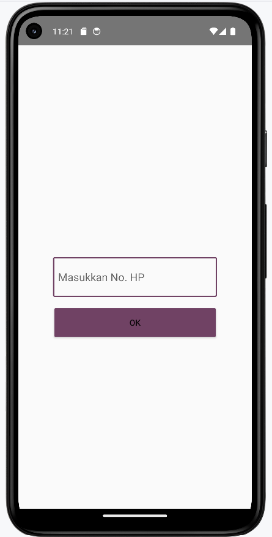
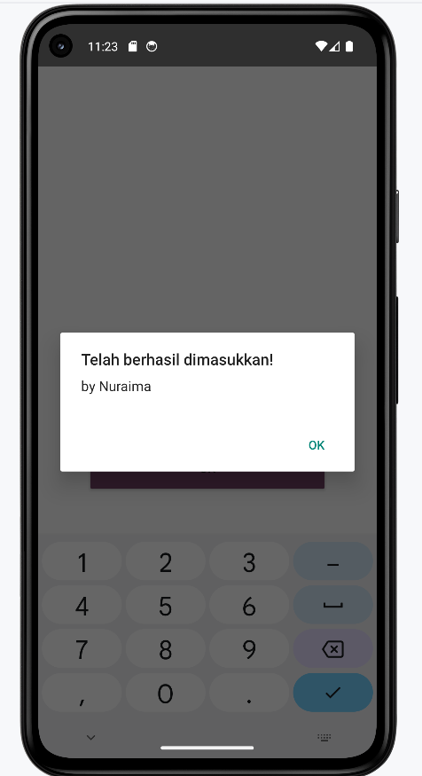

# Mengimplementasikan 2 Input Control

* 🔢 [INPUT PHONE NUMBER]
* ❗ [ALERT]

  

  </img>

  

  </img>

  

  </img>

  

  </img>

## Deskripsi

Proyek ini bertujuan untuk mengimplementasikan Input Control pada Android Native.

## Fitur

*  Numerik Keyboard
* Kolom Text untuk memasukkan nomor
* Tombol Alert
* ℹ️ Menampilkan pemberitahuan

## Teknologi

* 🪲 Kotlin
* ️ Android

## Catatan

*  Program ini masih dalam tahap pengembangan.
*  Fitur yang tersedia masih terbatas.
